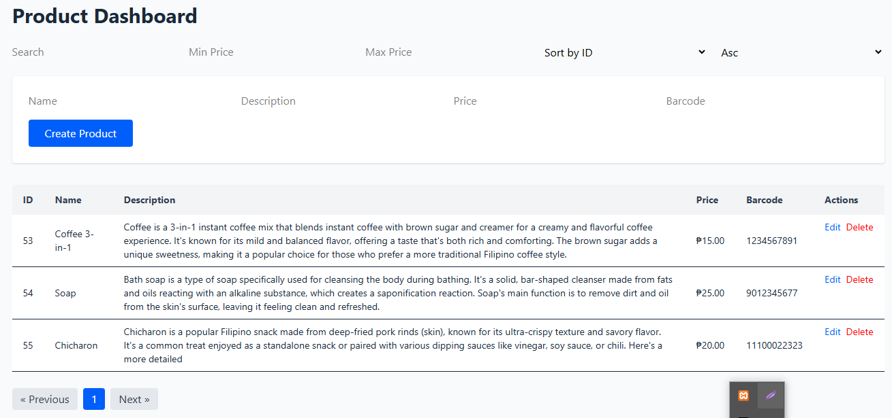

# Laravel Sanctum + React Product Dashboard

This is a simple **Product Dashboard** built with **React** (frontend) and **Laravel 12 with Sanctum** (backend) for managing a list of products. Features include CRUD operations, search, filters, sorting, and pagination.

## 📸 Screenshot

Here’s a preview of the Product Dashboard interface:

## 📦 Tech Stack

- **Frontend:** React, Axios, Tailwind CSS (optional styling)
- **Backend:** Laravel 12, Sanctum for authentication

---

💡 Key Features
✅ Search products by name/description

💰 Filter by price range

↕️ Sort by ID, name, or price

📃 Pagination with backend support

✏️ Edit and 🗑️ Delete product entries

🧾 Create new products with form

🔐 CSRF protection and stateful authentication via Laravel Sanctum
